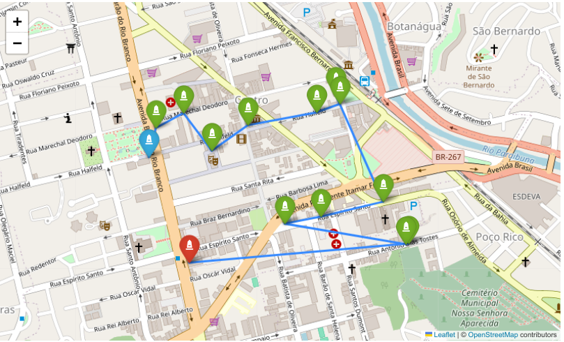
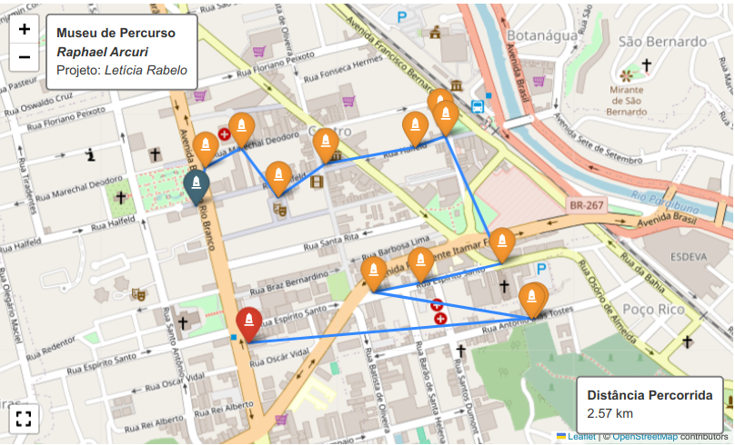

# Museu de Percurso Raphael Arcuri

No fim de semana, foi inaugurado oficialmente o [Museu de Percurso
Raphael
Arcuri](https://www.instagram.com/museuraphaelarcuri?igsh=MWRjNWV1cnZnczE5aQ==)
, projeto desenvolvido por [Letícia
Rabelo](https://www.instagram.com/leticiarabelo.arq?igsh=dndsYTdsemM4ZWdw)
que consiste em um passeio guiado, para explorar a pé as fachadas de
edificações consideradas como patrimônio histórico da cidade, de acordo
com o roteiro baseado em algumas obras do arquiteto ítalo-brasileiro,
reconhecido por projetar diversas construções em Juiz de Fora, no início
do século XX.

## Mapa interativo

Inspirados na série de artigos escrita por **Carlos Jimenez Uribe**,
intitulada *An intelligent decision support system for tourism in
Python*, reproduzimos o trajeto em um mapa interativo, para fins
didáticos, por meio de bibliotecas do Python

### Importamos as bibliotecas

``` python
import pandas as pd
import folium
from folium.plugins import Fullscreen
from typing import Tuple, List, Dict

pd.set_option('display.precision', 15)
```

### Definimos o data frame

Criamos o *data frame* contendo as coordenadas geográficas das obras de
*Raphael Arcuri*.

``` python

df_obras = pd.DataFrame(
    [['Paço Municipal', -21.76147732383513, -43.349845686905425],
    ['ED. CIAMPI', -21.760658258306233, -43.349631277710635],
    ['Galeria Pio X', -21.76024609457489, -43.348784136608764],
    ['Cine Theatro Central', -21.761301064584814, -43.347923147523424],
    ['Palacete Pinho', -21.760579286799263, -43.34682958935376],
    ['Cia. Dias Cardoso', -21.760207713387064, -43.34475343168256],
    ['Hotel Príncipe', -21.7599733, -43.3440394],
    ['Associação Comercial', -21.759722222222223, -43.344166666666666],
    ['Cia. Pantaleone Arcuri', -21.762723242493465, -43.342729824323776],
    ['Vila Iracema', -21.763148754507743, -43.34462311819184],
    ['Palacete dos Fellet', -21.76334208845321, -43.34573104693755],
    ['Residência Raphael Arcuri', -21.76393346168443, -43.34205031818927],
    ['Castelinho dos Bracher', -21.763894356739176, -43.341967760518045],
    ['Casa D´Itália', -21.764444444444443, -43.34861111111111]],
    columns=pd.Index(['obra', 'latitude', 'longitude'], name='JF')
)
```

### Inspecionamos o *data frame*


``` python
df_obras
```

    JF                       obra            latitude           longitude
    0              Paço Municipal -21.761477323835130 -43.349845686905425
    1                  ED. CIAMPI -21.760658258306233 -43.349631277710635
    2               Galeria Pio X -21.760246094574889 -43.348784136608764
    3        Cine Theatro Central -21.761301064584814 -43.347923147523424
    4              Palacete Pinho -21.760579286799263 -43.346829589353760
    5           Cia. Dias Cardoso -21.760207713387064 -43.344753431682562
    6              Hotel Príncipe -21.759973299999999 -43.344039400000000
    7        Associação Comercial -21.759722222222223 -43.344166666666666
    8      Cia. Pantaleone Arcuri -21.762723242493465 -43.342729824323776
    9                Vila Iracema -21.763148754507743 -43.344623118191841
    10        Palacete dos Fellet -21.763342088453211 -43.345731046937551
    11  Residência Raphael Arcuri -21.763933461684431 -43.342050318189273
    12     Castelinho dos Bracher -21.763894356739176 -43.341967760518045
    13              Casa D´Itália -21.764444444444443 -43.348611111111111


### Centralizamos o mapa

``` python
avg_location = df_obras[['latitude', 'longitude']].mean()
coords_list = avg_location.tolist()

map_jf = folium.Map(location=coords_list, zoom_start=13)
```

### Definimos os marcadores

Utilizamos marcadores padronizados para o mapa básico.

``` python
for obra in df_obras.itertuples():
    marker = folium.Marker(location=(obra.latitude, obra.longitude),
                           tooltip=obra.obra)
    marker.add_to(map_jf)

map_jf
```



### Definimos o roteiro

Inicialmente, definimos o roteiro com catorze paradas, embora o programa
oficial contemple apenas doze. Por outro lado, repetimos o circuito
aberto, em comum acordo com o material de divulgação, ao contrário do
circuito fechado, que sempre retorna ao ponto de partida. Os índices
determinan a sequência do circuito.

``` python
df_route = df_obras.copy()
df_route.index.name = 'sequência'

df_route
```


    JF                              obra            latitude           longitude
    sequência                                                                   
    0                     Paço Municipal -21.761477323835130 -43.349845686905425
    1                         ED. CIAMPI -21.760658258306233 -43.349631277710635
    2                      Galeria Pio X -21.760246094574889 -43.348784136608764
    3               Cine Theatro Central -21.761301064584814 -43.347923147523424
    4                     Palacete Pinho -21.760579286799263 -43.346829589353760
    5                  Cia. Dias Cardoso -21.760207713387064 -43.344753431682562
    6                     Hotel Príncipe -21.759973299999999 -43.344039400000000
    7               Associação Comercial -21.759722222222223 -43.344166666666666
    8             Cia. Pantaleone Arcuri -21.762723242493465 -43.342729824323776
    9                       Vila Iracema -21.763148754507743 -43.344623118191841
    10               Palacete dos Fellet -21.763342088453211 -43.345731046937551
    11         Residência Raphael Arcuri -21.763933461684431 -43.342050318189273
    12            Castelinho dos Bracher -21.763894356739176 -43.341967760518045
    13                     Casa D´Itália -21.764444444444443 -43.348611111111111


### Definimos os etapas do passeio

``` python
df_route_segments = df_route.join(
    df_route.shift(-1),  # map each stop to its next stop
    rsuffix='_next'
).dropna()  # last stop has no "next one", so drop it

df_route_segments
```


    JF                              obra            latitude           longitude  \
    sequência                                                                      
    0                     Paço Municipal -21.761477323835130 -43.349845686905425   
    1                         ED. CIAMPI -21.760658258306233 -43.349631277710635   
    2                      Galeria Pio X -21.760246094574889 -43.348784136608764   
    3               Cine Theatro Central -21.761301064584814 -43.347923147523424   
    4                     Palacete Pinho -21.760579286799263 -43.346829589353760   
    5                  Cia. Dias Cardoso -21.760207713387064 -43.344753431682562   
    6                     Hotel Príncipe -21.759973299999999 -43.344039400000000   
    7               Associação Comercial -21.759722222222223 -43.344166666666666   
    8             Cia. Pantaleone Arcuri -21.762723242493465 -43.342729824323776   
    9                       Vila Iracema -21.763148754507743 -43.344623118191841   
    10               Palacete dos Fellet -21.763342088453211 -43.345731046937551   
    11         Residência Raphael Arcuri -21.763933461684431 -43.342050318189273   
    12            Castelinho dos Bracher -21.763894356739176 -43.341967760518045   

    JF                         obra_next       latitude_next      longitude_next  
    sequência                                                                     
    0                         ED. CIAMPI -21.760658258306233 -43.349631277710635  
    1                      Galeria Pio X -21.760246094574889 -43.348784136608764  
    2               Cine Theatro Central -21.761301064584814 -43.347923147523424  
    3                     Palacete Pinho -21.760579286799263 -43.346829589353760  
    4                  Cia. Dias Cardoso -21.760207713387064 -43.344753431682562  
    5                     Hotel Príncipe -21.759973299999999 -43.344039400000000  
    6               Associação Comercial -21.759722222222223 -43.344166666666666  
    7             Cia. Pantaleone Arcuri -21.762723242493465 -43.342729824323776  
    8                       Vila Iracema -21.763148754507743 -43.344623118191841  
    9                Palacete dos Fellet -21.763342088453211 -43.345731046937551  
    10         Residência Raphael Arcuri -21.763933461684431 -43.342050318189273  
    11            Castelinho dos Bracher -21.763894356739176 -43.341967760518045  
    12                     Casa D´Itália -21.764444444444443 -43.348611111111111  


### Criamos o mapa interativo com marcadors personalizados

``` python
# Converta avg_location para uma tupla se for uma série do pandas
if hasattr(avg_location, 'iloc'):
    avg_location = (avg_location.iloc[0], avg_location.iloc[1])

map_jf = folium.Map(location=avg_location, zoom_start=13)

# Obter o número total de pontos na rota
total_points = len(df_route)

for i, stop in enumerate(df_route_segments.itertuples()):
    # Definir a cor do ícone baseado na posição na rota
    if i == 0:  # Primeiro ponto - azul
        icon_color = "blue"
    elif i == total_points - 1:  # Penúltimo ponto (o último segmento)
        icon_color = "red"
    else:  # Pontos intermediários - verde
        icon_color = "green"
    
    # Definir o marcador da parada atual
    marker = folium.Marker(location=(stop.latitude, stop.longitude),
                           tooltip=stop.obra,
                           icon=folium.Icon(color=icon_color, icon="monument", prefix="fa"))
    
    # Representar cada etapa do trajeto por um segmento de reta
    line = folium.PolyLine(
        locations=[(stop.latitude, stop.longitude), 
                   (stop.latitude_next, stop.longitude_next)],
        tooltip=f"De {stop.obra} até {stop.obra_next}",
    )
    # Adiconar elementos ao mapa
    marker.add_to(map_jf)
    line.add_to(map_jf)

# Definir o marcador da última parada - usando cor vermelha
folium.Marker(location=(stop.latitude_next, stop.longitude_next),
              tooltip=stop.obra_next,
              icon=folium.Icon(color="red", icon="monument", prefix="fa")).add_to(map_jf)

map_jf
```


### Definimos a função para cálculo da distância

``` python
from geopy.distance import geodesic

_Location = Tuple[float, float]


def ellipsoidal_distance(point1: _Location, point2: _Location) -> float:
    """Calculate ellipsoidal distance (in meters) between point1 and 
    point2 where each point is represented as a tuple (lat, lon)"""
    return geodesic(point1, point2).meters
```

### Calculamos a matriz de distância

Calculamos a distância de cada etapa do circuito.

``` python
df_route_segments['distance_seg'] = df_route_segments.apply(
    lambda stop: ellipsoidal_distance(
        (stop.latitude, stop.longitude), 
        (stop.latitude_next, stop.longitude_next)), 
    axis=1
)

print(df_route_segments)
```

    JF                              obra            latitude           longitude  \
    Sequência                                                                      
    0                     Paço Municipal -21.761477323835130 -43.349845686905425   
    1                         ED. CIAMPI -21.760658258306233 -43.349631277710635   
    2                      Galeria Pio X -21.760246094574889 -43.348784136608764   
    3               Cine Theatro Central -21.761301064584814 -43.347923147523424   
    4                     Palacete Pinho -21.760579286799263 -43.346829589353760   
    5                  Cia. Dias Cardoso -21.760207713387064 -43.344753431682562   
    6                     Hotel Príncipe -21.759973299999999 -43.344039400000000   
    7               Associação Comercial -21.759722222222223 -43.344166666666666   
    8             Cia. Pantaleone Arcuri -21.762723242493465 -43.342729824323776   
    9                       Vila Iracema -21.763148754507743 -43.344623118191841   
    10               Palacete dos Fellet -21.763342088453211 -43.345731046937551   
    11         Residência Raphael Arcuri -21.763933461684431 -43.342050318189273   
    12            Castelinho dos Bracher -21.763894356739176 -43.341967760518045   

    JF                         obra_next       latitude_next      longitude_next  \
    Sequência                                                                      
    0                         ED. CIAMPI -21.760658258306233 -43.349631277710635   
    1                      Galeria Pio X -21.760246094574889 -43.348784136608764   
    2               Cine Theatro Central -21.761301064584814 -43.347923147523424   
    3                     Palacete Pinho -21.760579286799263 -43.346829589353760   
    4                  Cia. Dias Cardoso -21.760207713387064 -43.344753431682562   
    5                     Hotel Príncipe -21.759973299999999 -43.344039400000000   
    6               Associação Comercial -21.759722222222223 -43.344166666666666   
    7             Cia. Pantaleone Arcuri -21.762723242493465 -43.342729824323776   
    8                       Vila Iracema -21.763148754507743 -43.344623118191841   
    9                Palacete dos Fellet -21.763342088453211 -43.345731046937551   
    10         Residência Raphael Arcuri -21.763933461684431 -43.342050318189273   
    11            Castelinho dos Bracher -21.763894356739176 -43.341967760518045   
    12                     Casa D´Itália -21.764444444444443 -43.348611111111111   

    JF                distance_seg  
    Sequência                       
    0           93.364875537012907  
    1           98.796363455731793  
    2          146.889090368273486  
    3          138.497147441194926  
    4          218.652565544818799  
    5           78.284040089994051  
    6           30.760167821265693  
    7          364.014944247991536  
    8          201.417064728352244  
    9          116.578398952466472  
    10         386.296860376926702  
    11           9.574199224964975  
    12         689.829427309359630  


### Calculamos a distância total a ser percorrida (km)

``` python
total_distance = df_route_segments['distance_seg'].sum()/1000
print(total_distance)
```

    2.572955145098353


### Criamos o mapa definitivo personalizado

``` python
map_jf = folium.Map(location=avg_location, zoom_start=13)

# Adicionar apenas o plugin de tela cheia
Fullscreen(
    position='bottomleft',
    title='Expandir',
    title_cancel='Sair',
    force_separate_button=True
).add_to(map_jf)

# Adicionar título no canto superior esquerdo
title_html = '''
    <div style="position: fixed; 
                top: 10px; left: 50px; width: auto; height: auto; 
                background-color: white; padding: 10px; z-index:9999;
                border: 2px solid grey; border-radius: 5px;
                font-family: Arial; font-size: 14px">
        <b>Museu de Percurso</b><br>
        <b><i>Raphael Arcuri</b></i><br>
        Projeto: <i>Letícia Rabelo</i>
    </div>
'''
map_jf.get_root().html.add_child(folium.Element(title_html))

# Adicionar distância percorrida no canto inferior direito
distance_html = f'''
    <div style="position: fixed; 
                bottom: 10px; right: 10px; width: auto; height: auto; 
                background-color: white; padding: 10px; z-index:9999;
                border: 2px solid grey; border-radius: 5px;
                font-family: Arial; font-size: 14px">
        <b>Distância Percorrida</b><br>
        {total_distance:.2f} km
    </div>
'''
map_jf.get_root().html.add_child(folium.Element(distance_html))


for stop in df_route_segments.itertuples():
    initial_stop = stop.Index == 0
    # marker for current stop
    icon = folium.Icon(icon='monument',
                       color='cadetblue' if initial_stop else 'orange',
                      prefix="fa")
                       
    marker = folium.Marker(
        location=(stop.latitude, stop.longitude),
        icon=icon, 
        # Exibir o nome e o número de cada parada
        tooltip=f"<b>Nome</b>: {stop.obra} <br>" \
              + f"<b>Parada</b>: {stop.Index} <br>"
    )
    # Representar cada etapa do trajeto por um segmento de reta
    line = folium.PolyLine(
        locations=[(stop.latitude, stop.longitude), 
                   (stop.latitude_next, stop.longitude_next)],
        # display the start, end, and distance of each segment
        tooltip=f"<b>De</b>: {stop.obra} <br>" \
              + f"<b>Até</b>: {stop.obra_next} <br>" \
              + f"<b>Distância</b>: {stop.distance_seg:.0f} m",
    )
    # Adicionar elementos ao mapa
    marker.add_to(map_jf)
    line.add_to(map_jf)

# Definir a última parada do trajeto com um marcador especial
folium.Marker(
    location=(stop.latitude_next, stop.longitude_next),
    tooltip=f"<b>Nome</b>: {stop.obra_next} <br>" \
          + f"<b>Parada</b>: {stop.Index + 1} <br>", 
    icon = folium.Icon(icon='monument', color='red', prefix="fa")
).add_to(map_jf);

# Salvar mapa
map_jf.save("roteiro_mpra.html")

map_jf  # show map
```



**Referências**

Uribe, C. J. (2024). *An intelligent decision support system for tourism
in Python*. Publicado em Jan 16, 2024. Disponível em:
<https://medium.com/@carlosjuribe/list/an-intelligent-decision-support-system-for-tourism-in-python-b6ba165b4236>
